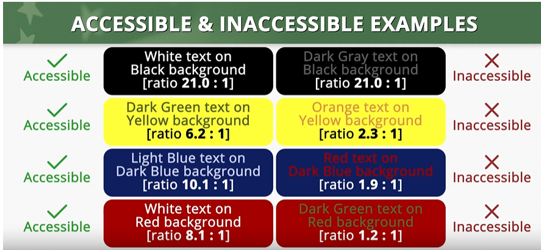
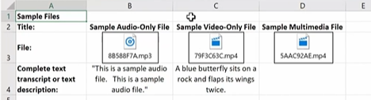

# How to Author and Test Microsoft Excel Worksheets for Accessibility

Use the following information to make Excel spreadsheets Section 508 compliant. 

[Section 508 - Excel Accessibility website](https://www.section508.gov/training/spreadsheets/aed-cop-xlsx00/)

## Module 0: Intro and Background

This course does not cover:
* Worksheets with macros or programmed formatting (saved in the .xlsm format)
* Excel for PC with forms enabled
* Restricted documents

## Module 1: Using Built-in Features to Organize Content and Ensure Logical Reading Order 

* The visual and/or logical reading order for a worksheet is left to right, top to bottom.
* Ensure that each spreadsheet tab in a workbook has a unique and descriptive name.
* Use the Cell Styles tool on Home tab to apply heading levels/section levels such as title and Heading levels 1-9. Right-click to modify the standard styles.
* Use the Format as Table tool to place the content in a data table format. Right-click the template to modify a standard style. (Note: Modify not available when I right-click - why?)

### Best practices
* Start all worksheets in cell A1.
* Do not span content over multiple rows or columns. An exception is if the first cell in a row has content that spills into the next cell(s), and there is no other content in the row.

### How to test
* Does the sheet have visual and/or logical reading order that is left to right, top to bottom?
* Can the sheet be navigated using the up/down/left/right keys? Does the navigation match the visual and logical reading order?

## Module 2: Ensuring the Contrast Ratio Between Text and Background is Sufficient
* Color palettes must have a strong color contrast between foreground and background, and text and background.
* Contrast standards for text are based on ratios between different sizes of text and the background:
  * Standard 12pt regular text ratio: 4.5:1 or higher
  * Large text, either 14pt bold or 18pt regular, ratio: 3:1

      
    
  Incidental text, text overlaid on images, and logotypes are excluded from this requirement.

### How to test

Use the Color Contrast Analyser external application to determine the contrast between the text and background. It can be downloaded from the [TPGI website](https://www.tpgi.com/color-contrast-checker/). If the text is black and the background is white, or close to white, you don't have to perform this test. 

## Module 3: Ensuring Color and Other Visual Characteristics are Also Described in Text

In addition to contrast, also consider how color and other visual characteristics, such as size, shape, and location, are used to convey meaning. Use text to duplicate the meaning of color or visual effects. 

## Module 4: Making Vital Background Information Accessible

Assistive technology does not automatically read information in headers, footers, and watermarks so you must duplicate any vital information in cell A1.

## Module 5: Using Built-In Features to Create Data Tables

Data table must be created using built-in table features so that assistive technology can read the table in a meaningful manner.

Pictures of tables, tables with merged or split cells, and tables within tables are not accessible because they cannot be read accurately. Ensure that when you select a table, the Table Design tab, not the Picture Design tab, is displayed. If you use **Find & Select > Go To** on the Home tab to navigate to a table, a table that is a picture is not available.

Apply a table name on the Table Design tab, on the left most section of the ribbon. 

Apply names to column headers. Click in the column headers to ensure that **Header Row** is selected on the Table Design tab. 

## Module 6: Adding Alternative Text to Images and Other Objects

Because assistive technology cannot infer meaning from images and other objects such as pictures, images, and icons with hyperlinks, you must apply alt text to them.

The alt text should desribe the purpose of the image, not what the image looks like. If you removed the image or object and replaced it with alt text and no key info was lost, you used the correct description in the alt text.

Additionally, images and other non-text elements cannot be anchored or embedded in a cell. They are floating objects and screen reader cannot access the alt text of floating objects. Add the alt text in a cell near the object or list non-text elements with descriptions in a separate appendix.

## Module 7: Creating Links with Unique and Descriptive Names

Each link must have a unique and descriptive name. The purpose of the link should be discernible when reading the surrounding content. Multiple "Click here" links do not promote accessibility.

Excel automatically creates a hyperlink when a full URL is specified but the URL may not make sense via a screen reader. If not, right-click to add link; then specify the text to display and the URL. As an example, https://www.section.508.gov/ is accessible because it is unique and the URL is descriptive and the purpose is discernible through context.

## Module 8: Ensuring Descriptions of Embedded Audio, Video and Multimedia Files are Accurate

If you embed an audio only, video only, or multimedia file in a spreadsheet, you must also provide additional info so individuals with disabilities have comparable access the info. 

| Media Type | Must Include |
| --- | --- |
| Audio only | Complete transcript |
| Video only | Text description |
| Multimedia | Synchronized captions and audio descriptions |
| | |

## Module 9: Excluding Flashing Objects

Never use flashing objects. They can casue seizures.

## Module 10: Saving in the .xlsx Format With a Descriptive Filename

Always use a descriptive name to identify the document or its purpose. Always use the .xlsx format because the authoring and testing instructions don't work in other formats.

