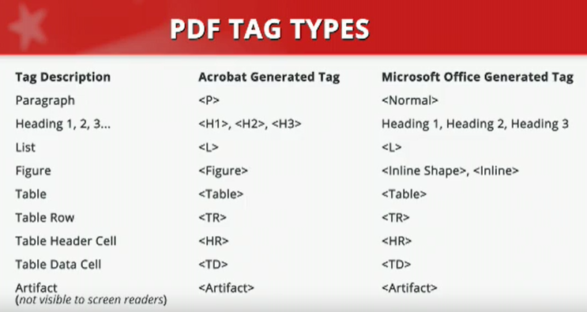
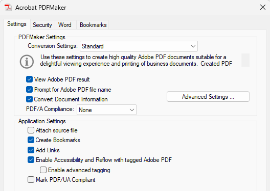
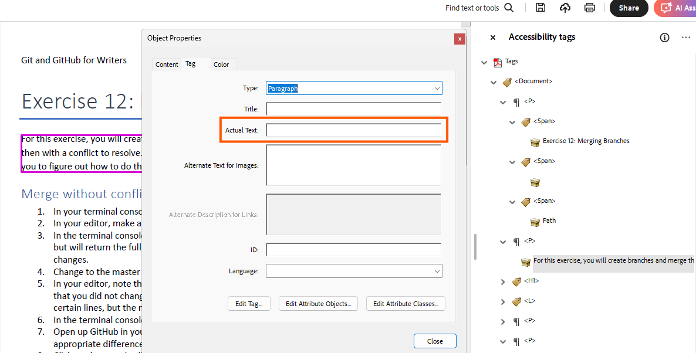

# How to Test and Remediate PDFs for Accessibility Using Adobe Acrobat DC

Use the following information to make PDFs Section 508 compliant. 

> [!Note] 
> The instructions in these notes may differ from the training video because I have the current version of Acrobat.

See the [Section 508 - PDF Accessibility website](https://www.section508.gov/training/spreadsheets/aed-cop-pdf00/).

## Module 0: Intro and Background

Information in the training is based on Section 508 Baseline Test Guide for PDFs and Section 508 PDF Checklist authored by the AED COP.

See [Content Creation: PDFs Authoring Guides](https://www.section508.gov/create/pdfs/authoring-guides/) and [Testing for Accessibility](https://www.section508.gov/test/).

> [!Note] 
> The Course does not support the process of evaluating or remediating Life Cycle documents for Section 508 conformance nor does it apply to documents that contains scripts.

## Module 1: What is a PDF?

A PDF is an electronic document that can be viewed, printed, and electronically submitted. It has three views:
* **Physical view**: Visual representation of the text and graphics; the print view. If a document is scanned, the PDF might not contain any actual content.
* **Content view**: Displays the actual content—textual and graphical elements of the PDF such as pages, containers, and tags. To view, select **View > Show/Hide > Side Panels > Content** or right-click on side panel to select.
* **Tag structure tree**: Displays the logical structure of the document and the reading order for assistive technology. Elements like headers, paragraphs, lists, and tables are displayed. To view, select **View > Show/Hide > Side Panels > Accessibility Tags** or right-click on side panel to select.

> [!Note]
> To expand the tree structure, press **Shift + 8**.

### Tags
Most documents are comprised of a few tags but 37 tags are available to fully convey the document's formatting and structure. Tag names from a source document outside of Acrobat may display differently in the structure tree. If all the outside tags map to standard Acrobat tags, then the tags are valid.

Right-click an element in the tree structure or click **. . .** to see options.

Use the [AED COP Section 508 Basic Testing Checklist - PDF](https://www.section508.gov/create/pdfs/authoring-guides/) to review PDFs for accessibility. All checklist items must be answered yes or be non-applicable. All issues must be resolved before the document is considered accessible.

You can also use the Prepare for Accessibility tool in Acrobat. Click **Check for Accessibility** to run a report.

### Creating a PDF

Two methods are available:
1. Convert scanned and non-scanned docs into PDFs using Acrobat. 

    Select **Menu > Create > PDF from ...** and then verify/correct accessibility. Use the Content, Tags, and Order panes and the Accessibility checker. 

    See [_Module 2: Testing PDFs for Accessibility_](#section-2-testing-a-pdf-for-accessibility) and 
    [_Module 4: Converting Scanned Documents into Section 508 Conformant PDFs_](#section-4-converting-scanned-documents-into-section-508-conformant-pdfs).  

2. Convert accessible files into PDFs with the Adobe plugin for Office applications.

    Click **Create PDF** in the Menu bar on the Acrobat tab.

> [!WARNING]
> If you create a PDF via the File menu, select **Save as Adobe PDF** to create a PDF with tags. If you print the document as a PDF, then the tags are not applied. 

#### Setting up the Acrobat plugin in Office apps
1. On the Acrobat tab, click **Preferences** and then check the Acrobat PDFMaker and Application settings.
    
2. Ensure that these values are selected on the Settings tab:
    * _Standard_ in **Conversion Settings** field
    * _View Adobe PDF Result_
    * _Prompt for Adobe PDF file name_
    * _Convert Document Information_
    * _None_ in **PDF/A Compliance** field
    * _Create Bookmarks_
    * _Add Links_
    * _Enable Accessibility and Relow with tagged Adobe PDF_

    

3. Click **Advanced Settings**, and then select the latest Acrobat version in the **Compatibility** field to ensure that the most current Accesibility features are applied to the PDF. 
4. Click **OK**. The settings should persist.

## Module 2: Testing a PDF for Accessibility

Each PDF must be visually verified to identify issues that cannot be detected by the automated testing tool, such as heading level structure and alternate text.

### Setting up PDF document properties 
1. Select **Menu > Document Properties**.
2. On the Description tab: 
    * Verify that a descriptive title is specified.
    * Verify that **Tagged PDF** value is _Yes_.
3. On the Security tab, verify that **Content Copying for Accessibility** is _Allowed_.      
4. On the Initial View tab, select _Document Title_ in the **Show** field.
5. On the Advanced tab, verify that the correct language is selected in the **Language** field.

> [!Note]
> If the document contains multiple languages, then the language is set as a property of the tag associated with the content that contains a language change before the document is considered fully accessible. 

### Document Contents

#### Confirming renderable content
In the side panel, select **Content**. When you click on a content item in the side panel, the corresponding content should highlight in the document. If there is no content, then Optical Character Recognition must be performed.

See [_Module 4: Converting Scanned Documents into Section 508 Conformant PDFs_](#section-4-converting-scanned-documents-into-section-508-conformant-pdfs).  

#### Examining tags in the Content pane

Confirm that the element in the document is associated with the correct tag in the Content pane. All elements must be tagged, otherwise the content is not accessible by assistive technology.

Elements that are tagged as an Artifact, which is a decorative image or repetitive content, are not inlcuded in the Tags structure but are shown in the Content pane.

#### Examining tags in the Accessibility tags pane

Open the Accessibility tags pane to view the tags assigneed to an element. To change a tag, right-click and select **Properties**.

Check the logical reading order. Tags must follow the visible layout of the page so that assistive technology can follow the natural flow of the document. Use the up and down arrow keys to navigate the tags through the document. The tags will be highlighted in the document. Rearrange the structure tree if the tags are not in order.

#### Logical tab order

If the PDF contains links or form field elements, such as text boxes or button controls, evaluate the logical tab order. The tab order must follow the logical layout of the page. Place the cursor in the first field and then tab through the document.

#### Figure Elements

Figure elements that are not decorative must contain alternate text. To view figures, select **Menu > Prepare for accessibility > Add alternate text**. The alt tex displayed in the document should match the alt text in the modal verbatim. 

> [!Note]
> The training video showed using the Order pane in the side panel to view figure and change alt text, but it did not work in my newer version of Acrobat. Start at 8:19 in the [Module 2 video](https://www.section508.gov/training/pdfs/aed-cop-pdf02/) to view process.

#### Data tables

Data tables must be tag appropriately:

* Data table => Table tag
* Column and row table header cells => TH tag
* Non-header cells are table data => TD tag

To verify tag using the Accessibility tags pane, highlight a cell in the table. Click **. . .** in the pane and select **Find Tag from Selection**.

Complex tables must contain proper scope, which denotes which data cells are headers. Span identifies the number of columns or rows a data cell extends across.

Open the Order pane and then select **. . . > Show reading order panel > Table Editor**. Click on a cell and then select **Table Cell Properties**. Verify the scope is set correctly. Also use the Table Editor to identify any cells that span more than one column or row.

The Table Editor tool may not work correctly so use the Tag Structure tree for tag verification if necessary and assistive technology to ensure that it reads correctly.

> [!Note]
> Previous 508 training said to avoid complex tables. Simplify them for better accessibility.

#### Form Field Elements
Each form field element must include a tool tip and appear in logical tab order. Tab through the document to verify. 

> [!Note]
> If the PDF is produced via Adobe LifeCycle Designer, testing in Acrobat is insufficient. Instead, use assistive technologies for testing. To determine the PDF producer, select **Menu > Document Properties**. The producer is listed in the Advanced section.

#### Links
Links must:
* Be uniquely identified with a clear purpose, function, or destination. 
* Appear in a logical tab order

If an image is a link, than the alt text can state the purpose, function, or destination. 

#### Sensory Characteristics
Characteristics such as color, size, shape, and location must include text to convey meaning. The text must be included in the source file.

Readability must also be evaluated using the color contrast analyser.
* Standard sized text must have a contrast ration of 4.5:1.
* Large text must have a contrast ratio of 3:1.

See [Module 2: Ensuring the Contrast Ratio Between Text and Background is Sufficient](Accessibility_Excel_gsa.md/#module-2-ensuring-the-contrast-ratio-between-text-and-background-is-sufficient)

### Using the Accessibility Checker
1. Select **All tools > Prepare for accessibility > Check for accessibility**. 
2. Click **Select All** in the Checking Options section, and then click **Start Checking**.

   The report is displayed in the Accessibility Checker pane. 
3. Right-click on errors to see options. Issues that require manual checks are noted. 
4. After you fix an issue, right-click and select **Check Again**.

See PDF accessibility information in the [Adobe Acrobat User Guide](https://helpx.adobe.com/acrobat/using/create-verify-pdf-accessibility.html).

### Adobe's Text to Speech tool
This tool cannot be used to verify accessibility because it does not function the same as a dedicated screen reader such as Jaws.

## Module 3: Remediating PDFs for Accessibility

### Document Properties

Select **Menu > Document Properties** to set the the PDF's document properties. A PDF must have:
* A descriptive title

  Specify the title on the Description Tab and then select _Document Title_ in the **Show** field on the Initial View tab.
* Allow content copying for accessibility ont eh Security tab  
* A specified primary language on the Advanced tab.

  If a language is not listed, you can download a language pack.

### Tagging a PDF

#### If a PDF is not tagged
1. Click **. . .** in the Accessibility tags pane and then select **Autotag document**.
2. Review the tags to verify that each is correct.
3. To change a tag, right-click and then select the correct tag in the **Type** field.

#### If a PDF contains multipe tagging errors
>[!Caution]
>GSA recommends deleting all tags and then tagging manually. The procedure is tedious if the document is of any length. There must be a better way such as updating the source document. 
1. In the Accessibility tags pane, select the root tag and then press **Delete** .
2. Select **. . . > Clear page structure**. 
3. In the Orders pane, select **. . . > Show reading order panel**. 
4. See the [video](https://www.section508.gov/training/pdfs/aed-cop-pdf03/) at 4:40 for the remaining instructions. The instructions are also on Reading order modal.

#### Creating a tag from the Selection tool
Use these instructions for elements that cannot be tagged via the Touch Up Reading Order tool such as block quotes, notes, and references.

1. In the Orders pane, select **. . . > Show reading order panel**. 
2. Draw a rectangle around the content to tag.
3. In the Accessibility tags pane, select **. . . > Create tag from selection**. 
4. Select the tag type and click **OK**.

#### Tagging Complex Content 
To tag elements which require a parent tag with nested tag, such as a list, you might use the New Tag tool and the Create Tags from the Selection tool. 

See the [video](https://www.section508.gov/training/pdfs/aed-cop-pdf03/) at 6:58. 

#### Manually Tagging Links
See the [video](https://www.section508.gov/training/pdfs/aed-cop-pdf03/) at 8:11. 

### Remediating Data Tables
The accessibility checker may return these two errors for data tables:
* Table header error

  Occurs when the table header tag is missing.
* Table regularity error

  Can occur if the table contains content that does not below in a data table or if scope or scan are not set properly for the table.

When remediating data tables retag contents that should not be part of the table. 

See the [video](https://www.section508.gov/training/pdfs/aed-cop-pdf03/) at 10:29. 

### Remediating Form Field Elements

Select **All tools > Prepare a form.**

See the [video](https://www.section508.gov/training/pdfs/aed-cop-pdf03/) at 11:50.

### Deleting Empty Tags

Empty tags are not associated with any content. 
1. In the Accessibility tags pane, review the tags for a tag without a child element. 
2. Click the tag and then click **Delete**.

### Setting Tag Properties
You can set special properties to individual tags. Examples include adding alt text to Figure tags or a language that differs from the primary language to a p tag. 
1. In the Accessibility tags pane, right-click the tag and select **Properties**. 
2. Specify the property on the Tag tab.

### Adjusting Logical Reading Order

If the Content view and the Tag Structure tree are not the same, adjust the reading order. The tag structure will automatically update. It is typically easier to change the logical reading order in the Order pane than change the tag order in the Accessibility tags pane.

1. In the Orders pane, click on the box icon of a numbered element that is out of order.
2. Drag the element to the correct location.

### Setting Logical Tab Order

An accessible form must be navigable without a mouse.

1. In the Pages pane, select the first page and press **CTRL+A**.
2. Select **. . . > Page Properties > Use Document Structure**.
3. Click **OK**.

## Module 4: Converting Scanned Documents into Section 508 Conformant PDFs
Scanned PDF documents do not contain renderable text that can be used by assistive technology. Access the Content pane to verify if the PDF contains actual content. 

### How to Enhance Scanned Pages

If a scanned document is of poor quality (i.e., poor contrast, skewed, speckled pages), you can optimize the page before performing OCR.

1. In the Scan & OCR pane, click **Enhance scanned file**.
2. Click settings icon and specify the settings as needed. 
3. Click **OK**.
4. Click **Enhance**.

### Performing Optical Character Recognition (OCR)
OCR cannot be performed if the page already contains rederable text or if the quality of the scan is too low. For scanning, Adobe recommends 300dpi for grayscale content and 600 dpi for color content.

1. To access OCR, select **All tools > Scan & OCR > Recognize text: In this file**.
2. Click settings icon and then specify this information:
    * The pages to scan.
    * _Searchable Image_ in the **Output** field.
    * _300 dpi_ in the **Downsample To** field for grayscale content or _600 dpi_ for color content.
3. Click **OK**.
4. Click **Recognize Text** to run OCR.

### How to Correct Recognized Text

OCR suspects are renderable text or images that may not have been recognized correctly. To identify and repair suspects:

1. In the Scan & OCR pane, click **Correct recognized text**.
2. Examine the suspect that is displayed in the **Image** field. 
    * If the suspect was recognized correctly, click **Accept**.
    * If the suspect was recognized incorrectly, specify the correct text in the **Image** field and then click **Accept**.
3. Repeat the process until all suspects have been reviewed.

### How to Evaluate OCR Results
Inspect the documents after you review the OCR suspects. You can review it in the Content pane or export it to Word. 

1. On the Convert tab, select **Microsoft Word** and ensure that DOCX is selected.
2. Click **Convert to DOCX**.
3. Compare the content in Word to the PDF file, making any corrections directly iin the PDF or via the Accesibility tags pane.

### How to Edit Textual Content of a PDF
* Use Acrobat for minor edits but pay attention the formatting and style as it can be altered when editing text.
* If large blocks of texct are not recognized, retype the paragraph in the **Actual Text** field in the Object Properties menu. The content specified in the **Actual Text** field does not replace the content that is displayed in the PDF but the assistive technology will read the actual text.

  

> [!Note]
> The training video mentioned the Tag Properties menu, not the Object Properties menu, but didn't explain further.

### How to Make the PDF Full Accessible
After the OCR errors are corrected, take these actions:
* Tag the PDF
* Add alt text to the images
* Test PDF for 508 conformance

### How to Support Signed Memorandoms as 508 Conformant PDFs
If secure e-signature is not available, typically a signed memorandum is a 508-conformant Word doc that was printed for signature and then scanned. If such a multi-page document contains only one or two pages with a signature block, then create a merged PDF document. Create a 508-conformant PDF from the Word doc pages without a signature, create a 508-conformant PDF from the scanned signature pages, and then merge the PDFs into one document. You must replace the unsigned page from the Word PDF with the scanned signature page. Use the Organize pages tool to create the merged document. Recheck the merged PDF for conformance.

> [!Note]
> After you create a merged PDF, use **Menu > Save as other > Reduced Size PDF** to create the smallest-sized document possible.

